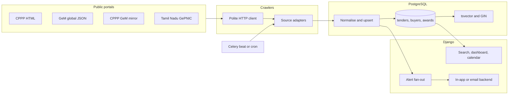

# TenderLens

TenderLens is a small tender desk for an MSME or vendor in India. It collects public tender notices, keeps one row per notice, and lets a user search them, save a filter, and hear about new matches. The expensive tender-intelligence products sell the same job: watch CPPP, GeM, and the state portals, and do not miss a deadline.

This repository is also a portfolio project for [Billy (tomlin7)](https://github.com/tomlin7). The Primenumbers SDE Intern role asks for Python, Django, PostgreSQL, and crawler work on Indian government tenders, policy, and infrastructure spending. TenderLens is that stack, pointed at a real use case. It does not call an LLM.

## What a vendor can do

- Search ingested tenders by keyword (PostgreSQL full-text), category, state, ministry, value, and closing date.
- Open a tender and follow the link back to the official portal.
- Create an account, save a search, and attach an in-app or email alert. Alerts run after each ingest, not on a timer of their own.
- Read a dashboard of listing volume, published estimated value by ministry and state, a deadline calendar, and award rows when a source actually publishes them.

Values are stored only when the portal prints a non-zero amount. A published `0.00` is treated as "not disclosed", because that is what the Tamil Nadu detail page does for some tenders.

## Architecture



Nginx and uWSGI serve the Django app on Ubuntu. Celery workers share the same code. Local development is `docker compose up` (Postgres, Redis, web, worker, beat).

## Data model

| Table | Role |
| --- | --- |
| `Buyer` | One contracting authority. Identity is the normalised ministry, department, organisation, and state. |
| `Tender` | One notice. Unique on `(source, source_key)`. Holds title, description, category, INR value, EMD, dates, status, and the official URL. |
| `Award` | One published award. Unique on `(source, source_key)`. Empty until a source gives an awardee without a captcha. |
| `CrawlCursor` | Per-source marker for the next incremental run. |
| `CrawlRun` | One attempt: timing, row counts, portal-reported totals, and errors. |
| `SavedSearch` | A user's named filter. |
| `Alert` | A filter, or a link to a saved search, plus `in_app` or `email`. |
| `Notification` | One delivery. Unique on `(alert, tender)`, so a rerun does not send the same notice again. |

`Tender.search_vector` is a `tsvector` maintained by a PostgreSQL trigger on title, description, and category (weights A, B, and C). A GIN index, `tender_search_gin`, backs `@@` search. Deadline, state, category, and source are btree indexes. Value and EMD cannot be negative.

Migrations live in `tenders/migrations/` and `alerts/migrations/`.

## Crawlers

Adapters share one interface: `fetch(CrawlContext) -> FetchResult`. `PoliteClient` waits between requests to the same host (default 2 seconds), reads `robots.txt`, and retries 429 and 5xx with exponential backoff (1s, 2s, 4s, plus a little jitter). A `Disallow` rule skips the URL. There is no captcha solver and no login.

Dedup key:

| Source | Key |
| --- | --- |
| CPPP | Portal tender id, e.g. `2026_DRDO_791201_1` |
| GeM | Bid number, e.g. `GEM/2026/B/8071078` |
| Tamil Nadu | Portal tender id, e.g. `2026_AU_704171_1` |

The same key from two feeds is merged in memory, then upserted. A rerun that sees the same content hash only bumps `last_seen_at`.

Incremental runs store the keys from the front page. The next run stops when a page is already known, because these listings are newest-first. Tamil Nadu stores each organisation's active count and skips an organisation whose count has not changed. The count is not stored if the page returned fewer rows than the portal claimed.

### CPPP (`eprocure.gov.in`)

`robots.txt` returned 404 on 2026-09-25, so there is no published disallow list. The client still waits 2 seconds.

`/cppp/globaltenders` is server-rendered HTML. Page 1 is the landing page. Later pages use the site's own base64 `url=` links. The listing has title, organisation, and dates. It does not include estimated value or EMD. `tendersfullview` returned HTTP 500 from this network, so those fields stay null for this feed. The on-page search form is captcha-gated and is not submitted.

`/cppp/latestactivetendersnew` and `/cppp/resultoftendersnew` returned HTTP 500 on the same day. The adapter still requests them and records the error. It does not invent rows. A web search snapshot of the latest-active table existed the same day, so the 500 is treated as this network's result, not as proof the page never works.

### GeM

`https://bidplus-global.gem.gov.in/all-bids-data` is the JSON POST the public global-tender page already makes. The page sends an empty `ci_csrf_token`. No login. Ongoing bids sorted by start date, newest first. The document includes bid number, title, ministry, department, quantity, a high-value flag, and start/end times. It does not include the contract value or the awardee. Buyer email fields are dropped before anything is stored. `robots.txt` on that host returned 404.

On 2026-09-25 the ongoing filter reported `numFound` 21. That is the global-tender slice, not the domestic GeM catalogue.

`bidplus.gem.gov.in` and `gem.gov.in` reset TLS from this network (`SSL_ERROR_SYSCALL`). The adapter probes the domestic host once and records the failure. Domestic bid numbers are read from CPPP's public GeM mirror, `/cppp/gemtender`, which is the same `GEM/YYYY/B/N` list. Several made-up `bidStatusType` values on the JSON API returned a larger set instead of an error, so award status is not inferred from them.

### Tamil Nadu (`tntenders.gov.in`)

This is the state portal. It is NIC GePNIC. `robots.txt` returned 404.

The public "Tenders by Organisation" page lists buyers and a count, with a session-scoped direct link. Following that link in the same cookie jar returns the buyer's active tenders. Detail links on that list publish EMD and tender value. The advanced search form and "Result of Tenders" are captcha forms. They are not submitted. A stale Tapestry session is detected and the index is loaded once more.

Maharashtra (`mahatenders.gov.in`) publishes `Disallow: /` and is not crawled. Other GePNIC states that were opened (Haryana, West Bengal, the central `etenders.gov.in` home) use the same captcha search. Tamil Nadu is the state source because its organisation index and detail pages answered without a captcha.

Selenium is not used. The pages that answer are server-rendered HTML or one JSON POST. The pages that need a browser are the ones behind a captcha, and those are skipped.

Recorded copies of the pages parsed in tests are in `tests/fixtures/`. They were captured on 2026-09-25. `python manage.py load_recorded` loads them without touching the network. The compose entrypoint runs that command on every start. It upserts on `(source, source_key)`, so a database that already has a live crawl does not grow duplicate rows.

## System design

### Requirements

A vendor needs to find relevant open tenders and not miss a closing date, without paying for a tender-intelligence subscription. The corpus is public. It is also large: on 2026-09-25 CPPP's GeM mirror reported 32,901 bids and the global-tender table reported 163 tenders. Tamil Nadu's organisation index reported a per-buyer active count that adds up across buyers (the crawl stores that sum on the crawl run). Freshness is hours, not seconds. Losing a row is worse than ingesting it twice. Search has to answer keyword plus a few facets. Alerts have to fire when a new row matches, and must not fire again for the same pair.

Out of scope: bidding, documents behind login, captcha solving, and award rows the portal will not show.

### Core entities

Buyer, Tender, Award, SavedSearch, Alert, Notification, CrawlCursor, CrawlRun. The stable identity of a tender is `(source, source_key)`, not the local integer primary key.

### API

The interface is server-rendered HTML, plus one health URL.

| Method | Path | Auth | Purpose |
| --- | --- | --- | --- |
| GET | `/` | no | Search |
| GET | `/tenders/<id>/` | no | Detail |
| GET | `/dashboard/` | no | Volume, value, deadlines |
| GET | `/dashboard/chart/<kind>.png` | no | Matplotlib chart |
| GET | `/calendar/` | no | Month of deadlines |
| GET | `/awards/` | no | Award rows |
| GET | `/healthz` | no | `{"status","db","redis"}` |
| POST | `/accounts/signup/` | no | Account |
| GET/POST | `/searches/`, `/alerts/`, `/notifications/` | yes | Saved filters and notices |

There is no public write API for tenders. Ingest is a management command and a Celery task.

### High-level design

Beat calls `tenders.crawl_sources` every six hours (or cron runs `manage.py crawl` under `flock`). The task builds one HTTP client and runs each adapter. The adapter returns records and a new cursor. The loader upserts inside one database transaction and then evaluates alerts against the ids inserted in that transaction. The web process only reads.

### Deep dive: crawl robustness

Failures are per feed, not fatal to the run. A 500 after retries is stored on `CrawlRun.error` and the other feeds continue. Connection errors use the same backoff. Robots rules are checked before the request. The domestic GeM TLS reset is one attempt, not three, because retrying a reset handshake does not help. Rate limit is per host, so CPPP's mirror and CPPP's global table share the 2 second gap. Caps (`--max-pages`, `--max-orgs`, `--max-details`) keep a run bounded even with `--full`.

### Deep dive: dedup

The portal id is the key. Content hash covers the fields a vendor sees. Equal hash means touch `last_seen_at` only. Changed hash updates the row and does not create a second alert, because alerts key off the first insert. Two feeds of the same GeM bid collapse before the write, and the copy that has a ministry or a value wins the blank fields.

### Deep dive: search indexing

The trigger writes `search_vector` in the database, so a bulk SQL fix and the ORM stay consistent. The query is `search_vector @@ websearch_to_tsquery('english', keywords)`, which can use the GIN index, then equality filters on category and state, and a join to buyer for ministry. `EXPLAIN (ANALYZE)` before and after dropping `tender_search_gin` is what `manage.py measure_search` records. On a small corpus the planner often prefers a sequential scan either way; the command still reports both execution times rather than claiming a speedup that did not happen.

### Deep dive: alert fan-out

After the insert, each active alert is a filtered query over the new ids only. The filter is the saved search when the alert points at one, so editing the search changes the next run. Delivery goes through `NOTIFICATION_BACKENDS`: `InAppBackend` stores the row, `EmailBackend` uses Django's mail backend. The unique `(alert, tender)` constraint is the idempotency key. A user with no email address gets a failed notification row instead of a retry loop.

At a larger alert count the loop of one query per alert should become one SQL join from new tenders to alerts, or a queue of `(alert_id, tender_id)` partitioned by user. The MVP does the loop because the user count here is whoever signs up on this demo.

### Scaling

The crawl is the slow part, and it is slow on purpose. A full pass of 32,901 GeM mirror rows at 2 seconds each is most of a day, and that is before detail pages. The right scale-up is more than one worker only if the portals' robots rules and a shared token bucket allow it. Sharding by source is natural: CPPP, GeM JSON, and Tamil Nadu do not share a cursor. PostgreSQL full-text on this table stays one instance until the row count is in the millions; the GIN index and a partial index on open deadlines (`deadline_at > now()`) are the first knobs. Read replicas can serve search. Alert evaluation should move to a queue before the web nodes do. Nothing here needs a second database.

## Measurements

All figures in this section were measured on 2026-09-25. Nothing here is an estimate. The machine was this cloud VM: `Linux-6.12.94+-x86_64-with-glibc2.39`, Python 3.12.3, 4 CPUs, `MemTotal` 16398384 kB. PostgreSQL was 16.15 (`Ubuntu 16.15-0ubuntu0.24.04.1`) on localhost, database `tenderlens`. The crawl client waited 2.0 seconds between requests to the same host. Full `EXPLAIN` JSON is in `docs/measurements/search.json` (measured at `2026-09-25T20:48:21.607091+00:00`).

### Rows crawled

Command, with caps so the run stayed polite:

```bash
python manage.py crawl --max-pages 4 --max-orgs 6 --max-details 12 --delay 2
```

| Run | Source | Rows stored | Fetch | Ingest | Notes |
| --- | --- | --- | --- | --- | --- |
| 1 | CPPP global | 0 | 14.954 s | 0.003 s | HTTP 500 from `/cppp/globaltenders`. No rows invented. |
| 1 | GeM CPPP mirror | 40 created | 41.639 s | 0.084 s, 476.179 rows/s | Page reported `Total Bid(s) : 32901`. |
| 1 | GeM JSON | 0 | (inside the GeM fetch) | — | `all-bids-data` returned an HTML rejection, not JSON. |
| 1 | Tamil Nadu | 6 created | 28.289 s | 0.021 s, 285.162 rows/s | 6 detail pages. All 6 have an EMD. None have an estimated value. |
| 2 | CPPP global | 37 created | 17.076 s | 0.076 s, 487.548 rows/s | Same command, later. Page reported `Total Tenders : 163`. 39 rows parsed, 37 left after in-batch dedup. |
| 2 and 3 | GeM JSON | 0 | — | — | Three identical POSTs per attempt were still rejected. Headers were not changed. |

Run 1 made 29 HTTP requests and finished in 85 seconds of wall clock. Run 2 (CPPP and GeM only) made 16 requests and finished in 52 seconds. `bidplus.gem.gov.in` failed the TLS handshake on every probe (`UNEXPECTED_EOF_WHILE_READING`).

After those runs, and before `load_recorded`, the database held **83 tenders** and **48 buyers**: 37 CPPP, 40 GeM mirror, 6 Tamil Nadu. `load_recorded` then inserted the 2 GeM JSON documents from the fixture (`created=2`, `updated=19`, `unchanged=1`). The search timings below were taken on the 83 crawled rows, before that insert. **0** tenders had an estimated value. **6** had an EMD, from ₹50,000.00 to ₹7,000,000.00. Tamil Nadu's organisation index listed **67** organisations whose displayed active counts sum to **5527**. That sum is what the index printed. It is not a count of rows stored. Result of Tenders was a captcha form and was not submitted, so award rows stayed at 0.

A separate POST to `all-bids-data` on the same date, outside the crawl loop, returned HTTP 200 and `numFound` 21 for ongoing global bids. Two of those documents, with buyer emails removed, are the parser fixture `tests/fixtures/gem_global_page1.json`. They were not inserted by the crawl, because the crawl's own POSTs were rejected.

Ingest rates above are `rows / ingest_seconds` for that ORM batch. They are not a bulk `COPY` benchmark. The batches are 6 to 40 rows.

### Query latency

`manage.py measure_search --term spectrometer` on those 83 rows. The term stems to `spectromet` and matches 2 rows. Buffers were already cached (the sequential scans report 19 shared hit blocks and 0 shared reads).

| Plan | Node | Planning | Execution |
| --- | --- | --- | --- |
| GIN index dropped | Seq Scan | 0.088 ms | 0.041 ms |
| GIN index present, planner's choice | Seq Scan | 0.854 ms | 0.054 ms |
| Sequential scans disabled | Bitmap Heap Scan on `tender_search_gin` | 0.054 ms | 0.037 ms |

At 83 rows the planner does not use the GIN index, and the single forced bitmap scan is not a meaningful speedup over the sequential scan. The index is still the right structure once the table is larger. That is the measurement, not a tuning win.

## Limits

- CPPP latest-active and award URLs returned HTTP 500 from this network on 2026-09-25. Detail pages on CPPP did too, so CPPP rows have no estimated value.
- Domestic `bidplus.gem.gov.in` did not complete a TLS handshake from this network. Domestic bids come from the CPPP mirror, which has no value and no awardee.
- GeM global JSON is a few dozen ongoing global tenders, not the full GeM catalogue, and it has no contract value.
- Tamil Nadu search and result pages are captcha-gated. Award history stays empty unless a future source publishes awards in the clear. The awards screen says so.
- Many Tamil Nadu detail pages print tender value `0.00`. Those are stored as null.
- The crawler does not walk organisation lists that are larger than the first page. The cursor is left unset so a later run tries again, and the gap is written on the crawl run.
- Incremental skip for Tamil Nadu uses the active count. A corrigendum that does not change the count is picked up on `--full` only.
- English `tsvector` stemming is a poor fit for Hindi titles and for identifiers. Tender ids still match as plain tokens when they appear in the title.
- No users, stars, or traffic numbers are claimed. The demo login in `.env.example` is for local compose only.

## Run it

```bash
cp .env.example .env
docker compose up --build
```

http://localhost:8000 — health at `/healthz`. Local demo user `demo` / `demo-tenderlens`, admin `admin` / `admin-tenderlens`. Change both before any shared host.

Without Docker, point `DATABASE_URL` at PostgreSQL 16, install `requirements.txt`, then:

```bash
python manage.py migrate
python manage.py load_recorded
python manage.py runserver
```

Tests and lint (CI does this against PostgreSQL 16):

```bash
pip install -r requirements-dev.txt
ruff check .
pytest
```

Ubuntu, Nginx, uWSGI, systemd, and cron are in `docs/RUNBOOK.md` and `deploy/`.

A live crawl:

```bash
python manage.py crawl --delay 2
```

Search timing:

```bash
python manage.py measure_search
```
